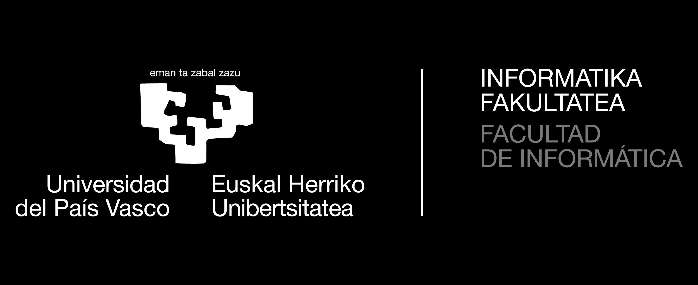

# Identificación y separación de voces e instrumentos


Este es un trabajo de fin de grado que se ha realizado con la dirección de Basilio Sierra Araujo como director e Izaro Goienetxea Urkizu haciendo el rol de codirección.
En este Trabajo de Fin de Grado, con el objetivo de desarrollar una herramienta de identificación de elementos en una pista musical, se ha llevado a cabo un proceso de investigación y desarrollo que ha incluido la revisión de literatura sobre el estado del arte en separación de fuentes musicales, la implementación y entrenamiento de modelos de inferencia de máscaras utilizando diferentes funciones de pérdida, y la evaluación comparativa de su desempeño sobre las mismas piezas musicales.

Este TFG no busca superar modelos del estado del arte como Spleeter,Open-Unmix o Demucs si no que se limita a dar un acercamiento incial "sencillo" para aprender sobre la construcción de los sistemas que dan solución a este problema y dar un estudio experimental controlado dentro del alcance al estado del arte sobre diferentes funciones de pérdida.

El sistema permite trabajar con dos configuraciones:

- **2 stems:** `vocals` + `accompaniment`
- **4 stems:** `vocals` + `bass` + `drums` + `other`

En la configuración de 2 stems, `accompaniment` se forma agrupando
`bass + drums + other`.

## 1. Funcionalidades principales

El repositorio incluye:

- entrenamiento de modelos de separación;
- inferencia y separación de archivos de audio;
- evaluación sobre un conjunto de test fijo;
- cálculo de una línea base basada en la mezcla original;
- generación automática de rankings y gráficos;
- carga de checkpoints;
- interfaz gráfica desarrollada con Streamlit;
- configuración de hiperparámetros desde la GUI.

---
## 2. Requisitos

Configuración utilizada durante el desarrollo:

- Python 3.10
- Conda
- Git
- FFmpeg / FFprobe
- CUDA opcional

El código selecciona GPU cuando CUDA está disponible y utiliza CPU en caso
contrario.

SoX no es necesario para la configuración final por defecto, ya que
`USE_SOX_EFFECTS=False`.

## 3. Instalación

Crear y activar un entorno Conda:

```bash
conda create -n tfg python=3.10 -y
conda activate tfg
```

Instalar FFmpeg:

```bash
conda install -c conda-forge ffmpeg -y
```

Instalar las dependencias python
```bash
python -m pip install --upgrade pip
python -m pip install -r requirements.txt
```

Comprobar ffmpeg
```bash
ffmpeg -version
ffprobe -version
```


## 3. Estructura del repositorio
.
├── GUI/                     # Interfaz Streamlit
├── commons/                 # Utilidades de audio, métricas, checkpoints, etc.
├── config/                  # Configuración global
├── data/                    # Construcción de datasets y transformaciones
├── datasets/                # Datos locales de entrenamiento/evaluación
├── models/                  # Arquitectura del modelo
├── pipeline/                # Entrenamiento, inferencia y deployment
├── scripts/                 # Evaluación, baseline y generación de resultados
├── checkpoints/             # Checkpoints entrenados
├── resultados_modelos/      # Resultados del protocolo experimental
├── resultados_gui/          # Resultados generados desde Streamlit
├── main.py                  # Punto de entrada por CLI
└── requirements.txt

## 4. Dataset
Para la tarea de separación de fuentes los datos de entrenamiento elegidos han sido tomados de la base de datos de **MUSDB18**. Se compone de 150 canciones completas de diferentes géneros junto con sus fuentes separadas: **drums**, **bass**, **vocals** y **others**.
El conjunto se separa en dos carpetas, train, de 100 canciones y test, de 50 canciones respectivamente. La documentación indica que los enfoques supervisados deben ser entrenados en el conjunto de entenamiento y probados en los conjuntos de test y de entrenamiento, y, además, que todas las pistas son estereofónicas y codificadas en 44.1kHz.

Por otro lado se ha definido un conjunto representativo de test para el protocolo de evaluación que se compone de 20 pistas extraidas del dataset original junto con sus respectivas fuentes llamado **representative_test**

Ubicaciones:

- Dataset de entrenamiento : datasets/mix_generation/foreground_train
- Dataset de validación : datasets/mix_generation/foreground_valid
- Dataset de test representativo : datasets/representative_test
- Pistas del test representativo : datasets/representative_test/track_00/ .. /track19/
- Estructura de cada pista de test : mixture.wav,vocals.wav,bass.wav,drums.wav,other.wav

MUSDB18 original : [MUSDB18](https://sigsep.github.io/datasets/musdb.html#musdb18-hq-uncompressed-wav)

Las carpetas esperadas por el pipeline son:

datasets/
├── mix_generation/
│   ├── foreground_train/
│   └── foreground_valid/
└── representative_test/
    ├── track_00/
    │   ├── mixture.wav
    │   ├── vocals.wav
    │   ├── bass.wav
    │   ├── drums.wav
    │   └── other.wav
    ├── track_01/
    └── ...


## 5. Checkpoints
Los checkpoints del entrenamiento local se guardan en **checkpoints/Mis_modelos_v2** mientras que los checkpoints del entrenamiento por GUI se guardarán en **checkpoints/Modelos_Usuario**

## 6. Entrenamiento mediante cliente

python main.py --mode train --lossfn <loss> --numsources <2|4> --maxepochs <epochs>

Ejemplo:
```
 - python main.py --mode train --lossfn l1 --numsources 2 --maxepochs 100
```
Ejemplo con Deep Feature EMD y cuatro STEMS
```
 - python main.py --mode train --lossfn deep_feature_emd --numsources 4 --maxepochs 100
```

## 7. Evaluación

python main.py --mode eval --lossfn <loss> --numsources <2|4>

Ejemplo:
```
 - python main.py --mode eval --lossfn deep_feature_emd --numsources 4
```
Evaluar el conjunto total de modelos: 
```
 - python -m scripts.evaluate_models
```
## 8. Baseline

La línea base utiliza la propia mezcla como estimación de cada fuente: 

```
python -m scripts.evaluate_mixture_baseline
```
## 9. Resultados y rankings

El script genera:

resultados_modelos/resumenes/
├── ranking_2stems.csv
├── ranking_4stems.csv
├── barplot_sisdr_2stems.png
└── barplot_sisdr_4stems.png

```
python -m scripts.generate_result_files
```

## 10. Separación de un archivo de audio

```
python main.py --mode deploy --lossfn <loss> --numsources <2|4> --input <audio>
```

Ejemplo:

```
python main.py --mode deploy --lossfn deep_feature_emd --numsources 4 --input audio.wav
```

## 11. GUI


La interfaz permite:

- Seleccionar una función de pérdida;
- Seleccionar 2 o 4 stems;
- Cargar checkpoints;
- Separar archivos WAV/MP3;
- Escuchar y descargar los stems generados;
- Visualizar waveforms y espectrogramas;
- Evaluar el checkpoint cargado;
- Entrenar nuevos modelos;
- Modificar determinados hiperparámetros.

```
streamlit run GUI/gui.py
```

## 12. Flujo recomendado

Partiendo de los checkpoints ya entrenados:

- 1. python -m scripts.evaluate_mixture_baseline
- 2. python -m scripts.evaluate_models
- 3. python -m scripts.generate_result_files

Para evaluar únicamente una configuración:

 - python main.py --mode eval --lossfn l2 --numsources 2


## 13. Limitaciones

Este proyecto debe interpretarse como un estudio experimental dentro del alcance
de un Trabajo de Fin de Grado.

Entre sus principales limitaciones se encuentran:

- Arquitectura recurrente sencilla frente a modelos modernos de separación;
- Procesamiento principal en mono;
- Utilización de la fase de la mezcla durante la reconstrucción;
- Conjunto de evaluación representativo limitado a 20 pistas;
- Diferencias de microbatch entre determinadas familias de pérdidas por
- Restricciones de memoria;
- Presencia de componentes aleatorios en el entrenamiento y en algunas pérdidas basadas en características profundas.

Por tanto, los resultados permiten comparar las configuraciones estudiadas
dentro del protocolo definido, pero no constituyen una comparación con el
estado del arte ni una repetición completamente determinista de cada
entrenamiento.
